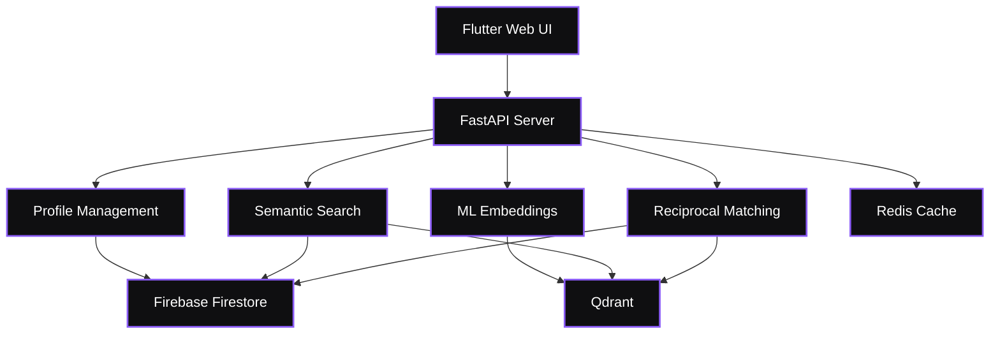
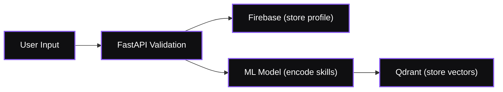
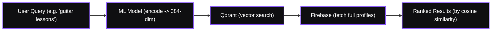
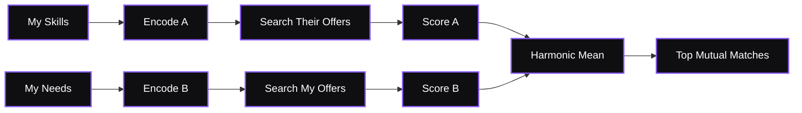

# $wap


## Challenge Statement

In Arkansas, thousands of people have talent, but limited access to opportunity. Small businesses make up **99.3% of all enterprises (≈ 258,000)**, yet the state still ranks **40th out of 51** in overall economic activity.

Rising costs mean many small business owners skip professional services — not because they lack vision, but because every dollar goes toward staying open. At the same time, college students and freelancers across Little Rock possess valuable skills they can’t fully use or afford to market.  

The problem isn’t a lack of ability. it’s a **lack of access**.  

**$wap** addresses this by asking:  
- How might we help communities unlock value without relying on money?  
- How might we turn *“what you can do”* into *“what you need”*?  
- How might AI connect people so skills never go unused?
  
## Project Description  

**$wap** is an AI-powered skill-exchange platform that lets people **trade skills instead of cash**. It creates a new, inclusive economy where your abilities — not your wallet — open doors.  

### How It Works  
1. **Create a Profile** — List the skills you can offer and what you need.  
2. **AI Matchmaking** — Machine learning pairs you with users whose skills and availability fit yours.  
3. **Swap Fairly** — Exchange services, time, or expertise — no money required.  
4. **Earn & Redeem Credits** — Every successful swap earns credibility and “swap credits.”  
5. **Build Trust** — Ratings and feedback verify quality and accountability.  

### Example  
A college student in Little Rock who codes websites can trade with a hairstylist who needs a site.  
She builds the website; he braids her hair.  
No cash — just community, fair value, and mutual growth.

## Why It Matters to Little Rock and Arkansas  

- **Small Business Owners** often skip marketing or tech services because every dollar counts.  
- **College Students** need real-world experience but can’t afford mentorship or tools.  
- **Freelancers & Creators** have skills that sit idle without capital or visibility.  

By turning skills into currency, **$wap activates Arkansas’s underused talent** and fosters a local economy built on collaboration and trust — not cash.

## Unique Value Proposition  

Traditional freelance platforms require money, subscriptions, and transaction fees.  
**$wap reimagines value exchange as reciprocity, not currency.**  

- No middlemen — only fair exchange.  
- No barriers — anyone can start with what they know.  
- No limits — skills build community wealth.  

For **small businesses**, it means affordable growth.  
For **freelancers**, it means stronger portfolios and networks.  
For **college students**, it means real-world experience without debt. 

## Tech Stack

Website / Frontend: Flutter (web) — responsive UI, single codebase targeting web/desktop/mobile.

#### Frontend

- Built with Flutter & Dart

   

**Tech Stack:**
- **Framework**: Flutter 3.9+ with Material Design 3
- **Language**: Dart
- **State Management**: StatefulWidgets with setState
- **Authentication**: Firebase Auth with Google Sign-In
- **Database**: Cloud Firestore for user profiles and data persistence
- **Storage**: Firebase Storage for media assets
- **HTTP Client**: `http` package for backend API communication
- **3D Rendering**: `model_viewer_plus` for interactive 3D models (.glb assets)
- **Responsive Design**: Adaptive layouts for mobile, tablet, and desktop

**Key Features:**
- 🔐 **Authentication**: Email/password and Google OAuth sign-in
- 🔍 **Semantic Search**: Real-time search with timeout handling and retry logic
- 🎨 **Modern UI**: Dark theme with purple accent, gradient buttons, and smooth animations
- 📱 **Responsive**: Works seamlessly across web, iOS, and Android
- 🎯 **3D Models**: Interactive ModelViewer components for engaging visuals
- 🚀 **Performance**: Optimized asset bundling and lazy loading

**Architecture Highlights:**
- Service-based architecture (`AuthService`, `SearchService`, `ProfileService`)
- Reusable widget components (`AppSidebar`, custom form fields)
- Centralized theme management with Material 3 ColorScheme
- Error handling with user-friendly snackbar notifications
- Web-safe CORS handling (omits Authorization header on web to avoid preflight)

**Deployment:**

The frontend is deployed on **Netlify** for fast, reliable hosting with global CDN distribution.

**Deployment Process:**
1. **Build**: Run `flutter build web --release` to generate optimized production assets
2. **Deploy**: Use `netlify deploy --prod --dir build/web` to push to production
3. **CDN**: Assets are automatically distributed across Netlify's global CDN
4. **SSL**: HTTPS enabled by default with automatic certificate management

**Live URL**: [https://swap-besmart.netlify.app](https://swap-besmart.netlify.app)

**Why Netlify?**
- ⚡ **Instant Deploys**: Changes go live in seconds
- 🌍 **Global CDN**: Fast loading times worldwide
- 🔒 **Secure**: Automatic HTTPS and DDoS protection
- 🔄 **CI/CD Ready**: Can integrate with GitHub for automatic deploys
- 📊 **Analytics**: Built-in deployment and performance monitoring
- 💰 **Free Tier**: Generous free tier perfect for MVP deployment

**Configuration for Flutter Web:**
- Assets are bundled in `build/web/assets/assets/` (double nesting)
- 3D models (.glb files) referenced with `assets/assets/` prefix for web compatibility
- Firebase OAuth configured with Netlify domain in authorized domains list
- Responsive breakpoints: mobile (<780px), tablet (780-1200px), desktop (>1200px)
#### Backend

Built with FastAPI and machine learning for smart skill matching.

- **Python 3.11** + **FastAPI** - REST API
- **Firebase Firestore** - User profile storage
- **Qdrant Cloud** - Vector database for semantic search
- **Redis** - Caching layer (16x faster repeat queries)
- **sentence-transformers (BERT)** - Text embedding model
- **Docker** - Containerization
- **Fly.io** - Production hosting

   

**Backend Features:**
- Semantic search using BERT (finds skills by meaning, not just keywords)
- Reciprocal matching algorithm (finds mutual exchanges)
- Skill recommendation engine (suggests complementary skills)
- Fast vector similarity search (~80ms, ~5ms with cache)
- Redis caching layer (16x speedup on repeat queries)
- 384-dimensional embeddings for each skill
- Harmonic mean scoring for balanced matches

**Production API:** `https://swap-backend.fly.dev`

**[Full Backend Documentation](wap-backend/README.md)**

#### Authentication & Database

- **Firebase Authentication** - Secure user management
- **Firebase Firestore** - Profile data storage with automatic indexing
- **Qdrant Cloud** - Vector storage for 10,000+ profiles (free tier)
- **Redis** - Cache layer (local dev only, not on production yet)

## Architecture



### Data Flow



**Semantic Search:**



**Reciprocal Matching:**



### Performance

| Operation | Cached | Uncached | Components Used |
|-----------|--------|----------|-----------------|
| Semantic Search | ~5ms | ~80ms | FastAPI → ML → Qdrant → Firebase |
| Reciprocal Match | ~8ms | ~120ms | FastAPI → ML → Qdrant (2x) → Firebase |
| Profile Create | - | ~150ms | FastAPI → Firebase → ML → Qdrant |
| Profile Read | - | ~20ms | FastAPI → Firebase |
| Health Check | - | ~1ms | FastAPI only |

*Tested on: Fly.io (1GB RAM, 1 CPU), 50+ profiles*

**Note:** Redis caching speeds up repeat queries by ~16x. Currently only running in local dev (docker-compose), not deployed to production yet.

## API Documentation

### Backend REST APIs

**Production Base URL:** `https://swap-backend.fly.dev`  
**Local Base URL:** `http://localhost:8000`  
**Interactive Docs:** `https://swap-backend.fly.dev/docs` (Swagger UI)

---

#### 1. Health Check API

**Endpoint:** `GET /healthz`

Verify backend services are operational.

**Request:**
```bash
curl https://swap-backend.fly.dev/healthz
```

**Response:** `200 OK`
```json
{
  "status": "healthy",
  "firebase": "connected",
  "qdrant": "connected"
}
```

---

#### 2. Profile Management API

##### Create/Update Profile
**Endpoint:** `POST /profiles/upsert`

Create a new user profile or update existing one with skill embeddings.

**Request Body:**
```json
{
  "uid": "sarah_j_2024",
  "email": "sarah.johnson@gmail.com",
  "display_name": "Sarah Johnson",
  "skills_to_offer": "I can teach web development with React and JavaScript. I also help people build their first website from scratch.",
  "services_needed": "Looking for someone who can teach me product photography and basic photo editing skills.",
  "bio": "Software engineer who loves building things",
  "city": "Little Rock"
}
```

**Response:** `200 OK`
```json
{
  "uid": "sarah_j_2024",
  "email": "sarah.johnson@gmail.com",
  "display_name": "Sarah Johnson",
  "skills_to_offer": "I can teach web development with React and JavaScript. I also help people build their first website from scratch.",
  "services_needed": "Looking for someone who can teach me product photography and basic photo editing skills.",
  "bio": "Software engineer who loves building things",
  "city": "Little Rock",
  "created_at": "2025-11-08T10:30:00.000Z",
  "updated_at": "2025-11-08T10:30:00.000Z"
}
```

What happens:
1. Profile stored in Firebase Firestore
2. Skills text converted to vectors using BERT
3. Vectors indexed in Qdrant for search

**Try it:**
```bash
curl -X POST https://swap-backend.fly.dev/profiles/upsert \
  -H "Content-Type: application/json" \
  -d '{
    "uid": "marcus_williams",
    "email": "marcus.w@email.com",
    "display_name": "Marcus Williams",
    "skills_to_offer": "I can help you learn how to play bass guitar and understand music theory basics",
    "services_needed": "Want to learn mobile app development, especially Flutter"
  }'
```

##### Get Profile
**Endpoint:** `GET /profiles/{uid}`

Retrieve someone's profile.

**Response:** `200 OK`
```json
{
  "uid": "tyler_designs",
  "email": "tyler.mitchell@yahoo.com",
  "display_name": "Tyler Mitchell",
  "skills_to_offer": "I can teach graphic design using Figma and Adobe Illustrator. I also do logo design and brand identity work.",
  "services_needed": "Need help learning Spanish for an upcoming trip to Barcelona",
  "bio": "Creative designer in Fayetteville",
  "city": "Fayetteville",
  "created_at": "2025-11-07T14:22:00.000Z",
  "updated_at": "2025-11-08T09:15:00.000Z"
}
```

**Try it:**
```bash
curl https://swap-backend.fly.dev/profiles/tyler_designs
```

---

#### 3. Semantic Search API

**Endpoint:** `POST /search`

Search using natural language. Works by meaning, not just keywords

**Search Modes:**
- **`offers`**: Find people who can teach you something
- **`needs`**: Find people who want to learn what you know
- **`both`**: Search everything

**Request:**
```json
{
  "query": "someone who can help me understand how to make beats and produce music",
  "mode": "offers",
  "limit": 5
}
```

**Response:** `200 OK`
```json
[
  {
    "uid": "dj_carlos",
    "display_name": "Carlos Rodriguez",
    "email": "carlosr.beats@gmail.com",
    "skills_to_offer": "I teach music production using FL Studio and Ableton. I can show you how to make trap, hip-hop, and R&B instrumentals.",
    "services_needed": "Want to get better at video editing, especially transitions and color grading",
    "bio": "Producer and DJ, been making beats for 8 years",
    "city": "Conway",
    "score": 0.87
  },
  {
    "uid": "melody_davis",
    "display_name": "Melody Davis",
    "email": "melody.davis@outlook.com",
    "skills_to_offer": "Can teach you music theory, sound design, and how to mix your own tracks professionally",
    "services_needed": "Looking for someone to teach me content writing and copywriting",
    "city": "Jonesboro",
    "score": 0.82
  }
]
```

Score ranges from 0 to 1 (higher = better match).

**More examples:**

Looking for a language tutor:
```bash
curl -X POST https://swap-backend.fly.dev/search \
  -H "Content-Type: application/json" \
  -d '{
    "query": "someone who speaks French fluently and can teach me conversational French",
    "mode": "offers",
    "limit": 5
  }'
```

Want to teach your coding skills:
```bash
curl -X POST https://swap-backend.fly.dev/search \
  -H "Content-Type: application/json" \
  -d '{
    "query": "I know JavaScript and React, looking for people who want to learn web development",
    "mode": "needs",
    "limit": 5
  }'
```

General search:
```bash
curl -X POST https://swap-backend.fly.dev/search \
  -H "Content-Type: application/json" \
  -d '{
    "query": "cooking and baking skills",
    "mode": "both",
    "limit": 8
  }'
```

---

#### 4. Skill Recommendation API

**Endpoint:** `POST /search/recommend-skills`

Get personalized skill recommendations based on what you already know. Analyzes profiles with similar skills and suggests complementary skills that are commonly learned together.

**Algorithm:**
1. Encode your current skills using BERT
2. Search for profiles with similar skill sets
3. Extract skills from those profiles (both what they offer and need)
4. Rank by frequency and relevance score
5. Return top recommendations

**Request:**
```json
{
  "current_skills": "Python programming and web development",
  "limit": 5
}
```

**Response:** `200 OK`
```json
[
  {
    "skill": "SQL databases and data modeling",
    "score": 0.845,
    "reason": "Common among 12 similar profiles"
  },
  {
    "skill": "Docker containerization and deployment",
    "score": 0.732,
    "reason": "Common among 8 similar profiles"
  },
  {
    "skill": "Git version control and collaboration",
    "score": 0.698,
    "reason": "Common among 10 similar profiles"
  }
]
```

**Try it:**
```bash
curl -X POST https://swap-backend.fly.dev/search/recommend-skills \
  -H "Content-Type: application/json" \
  -d '{
    "current_skills": "JavaScript and React development",
    "limit": 5
  }'
```

**Features:**
- Cached for 2 hours for fast repeat queries
- Smart scoring balances frequency and semantic relevance
- Filters out vague or too-short skills
- Useful for skill gap analysis and learning path planning

---

#### 5. Reciprocal Matching API

**Endpoint:** `POST /match/reciprocal`

Find mutual skill exchange partners where **you teach them** and **they teach you**.

**Algorithm:**
1. Search **their offers** vs **your needs** → Score A
2. Search **your offers** vs **their needs** → Score B  
3. Calculate **harmonic mean**: `2 × (A × B) / (A + B)`
4. Rank by combined score

**Why Harmonic Mean?**
Penalizes one-sided matches. Both scores need to be high.
- Good match: `(0.9, 0.9) → 0.90`
- One-sided: `(0.9, 0.3) → 0.45`

**Request:**
```json
{
  "my_offer_text": "I can teach web development, specifically building sites with React and handling databases",
  "my_need_text": "Want to learn acoustic guitar, maybe some basic music theory too",
  "limit": 10
}
```

**Response:** `200 OK`
```json
[
  {
    "uid": "brandon_strings",
    "display_name": "Brandon Hayes",
    "email": "brandonh.music@gmail.com",
    "skills_to_offer": "I teach acoustic guitar, electric guitar, and music theory for beginners and intermediate players",
    "services_needed": "Really want to learn web development so I can build my own website for my music lessons",
    "bio": "Guitarist in Hot Springs, been playing for 12 years",
    "city": "Hot Springs",
    "score": 0.91
  },
  {
    "uid": "jasmine_codes",
    "display_name": "Jasmine Parker",
    "email": "jasmine.p@outlook.com",
    "skills_to_offer": "Can teach you piano basics and how to read sheet music",
    "services_needed": "Need help understanding how to code and build web applications",
    "bio": "Piano teacher trying to transition to tech",
    "city": "Bentonville",
    "score": 0.78
  }
]
```

**Try it:**
```bash
curl -X POST https://swap-backend.fly.dev/match/reciprocal \
  -H "Content-Type: application/json" \
  -d '{
    "my_offer_text": "I can help with graphic design and teach you Adobe Photoshop and Illustrator",
    "my_need_text": "Looking to learn how to bake bread and pastries from scratch",
    "limit": 10
  }'
```

---

### API Response Codes

| Code | Meaning | Description |
|------|---------|-------------|
| 200 | OK | Request successful |
| 400 | Bad Request | Invalid input (validation error) |
| 404 | Not Found | Profile not found |
| 500 | Internal Server Error | Server-side error |

---

### External Services & APIs Used

#### 1. Firebase Services
- **Firebase Authentication** - User identity management
- **Firebase Firestore** - NoSQL document database
  - Collection: `profiles`
  - Auto-indexing on `uid`, `email`
  - Real-time sync capabilities

#### 2. Qdrant Cloud API
- **Service:** Vector similarity search database
- **Plan:** Free tier (1GB storage, ~10,000 profiles)
- **Features Used:**
  - Named vectors (`offer_vec`, `need_vec`)
  - HNSW indexing for fast search
  - Cosine similarity matching
  - REST API over HTTPS

#### 3. Hugging Face Transformers
- **Model:** `sentence-transformers/all-MiniLM-L6-v2`
- **Purpose:** Convert text to semantic embeddings
- **Output:** 384-dimensional vectors
- **Features:**
  - Pre-trained on semantic similarity tasks
  - Normalized embeddings
  - Fast inference (~10-20ms per encoding)

#### 4. Redis
- **Service:** In-memory data store for caching
- **Deployment:** Local development only (via docker-compose)
- **Features:**
  - Sub-5ms response times
  - 1 hour TTL on cached results
  - Automatic cache invalidation on profile updates
  - Graceful degradation if unavailable

#### 5. Fly.io Platform
- **Service:** Cloud application hosting
- **Region:** US East (Virginia)
- **Features:**
  - Auto-scaling
  - Global CDN
  - HTTPS by default
  - Health checks

---

**[Complete API Documentation with Postman Examples](wap-backend/docs/API.md)**
## User Stories

- **As a User**, I want to sign up with email/password or Google OAuth so I can quickly create an account and access the platform.
- **As a Creator**, I want to post my skills with a clear title, description, duration, mode (remote/in-person), and tags so others can discover what I can offer.
- **As a Seeker**, I want to search for skills using semantic search so I can find people who offer what I need to learn, even with natural language queries.
- **As a User**, I want to browse curated skill cards on the Discover page so I can explore available offerings without searching.
- **As a User**, I want to request a skill swap from someone so we can connect and exchange services.
- **As a User**, I want to manage my profile with my skills to offer and services needed so others can find me through search.
- **As a User**, I want to see my requests in a dedicated dashboard so I can track ongoing and completed exchanges.

## Walkthrough: Using $wap

**Quick Start Guide:**

### 1. **Sign Up / Sign In**
   - Visit: [https://swap-besmart.netlify.app](https://swap-besmart.netlify.app)
   - Choose **Sign Up** to create a new account
   - Options:
     - Email/password authentication
     - Google Sign-In (one-click OAuth)
   - Fill in your profile details (name, skills to offer, services needed)

### 2. **For Skill Providers (Creators)**
   - Click **"Post a Skill"** from the sidebar
   - Fill in the skill details:
     - **Title**: Clear, descriptive name (e.g., "React Hooks Masterclass")
     - **Category**: Select from Design, Coding, Writing, Language, Music, etc.
     - **Description**: What you'll teach and what learners will gain
     - **Duration**: Estimated hours for the exchange
     - **Mode**: Remote, In-person, or Both
     - **Tags**: Add relevant keywords for discoverability
   - Click **"Publish"** to make your skill live
   - Your skill appears on the Discover page with verified badge (if applicable)

### 3. **For Skill Seekers (Buyers)**
   - **Browse**: Explore the Discover page to see curated skill cards
   - **Search**: Use the semantic search bar to find specific skills
     - Example queries: "learn guitar", "web development help", "design logo"
     - Backend uses AI embeddings to match your query with relevant skills
   - **Filter**: Use category chips (All Skills, Design, Coding, etc.)
   - **Preview**: Click on any skill card to see:
     - Full description
     - Provider rating
     - Duration and mode
     - Tags
   - **Request**: Click the **"Request"** button to initiate a skill swap
   - Fill in your request details and submit

### 4. **Managing Requests**
   - Click **"Requests"** in the sidebar
   - View all incoming and outgoing requests
   - Track status: Pending, Accepted, Completed
   - Communicate with swap partners
   - Mark completed exchanges

### 5. **Search & Discovery**
   - **Top Search Bar**: Quick search from any page
   - **Discover Page Search**: Detailed search with filters
   - **Clear Results**: Click the "X" or "Close" button to return to default view
   - Search results show:
     - User profiles with matching skills
     - Relevance score
     - Skills offered and needed
     - Bio and location

---

### Demo/Test Credentials

For testing without creating a new account:

Email: amy@gmail.com

Password: Test123!

### Link to Demo Presentation
- placeholder: https://your-presentation-link

### Team Checklist
- [x] Team photo
- [x] Team Slack channel
- [x] Communication established with mentor
- [x] Repo created from template
- [x] Flight Deck / Hangar registration (placeholder)

### Project Checklist
- [x] Presentation complete and linked  (placeholder)
- [x] Code merged to main branch

### School Name
Philander Smith University

### Team Name
Panthers

### Contributors
* Immanuella Emem Umoren
* Kenna Agbugba
* Otito Udedibor
* Olaoluwa James-Owolabi
* Emmanuella Turkson
