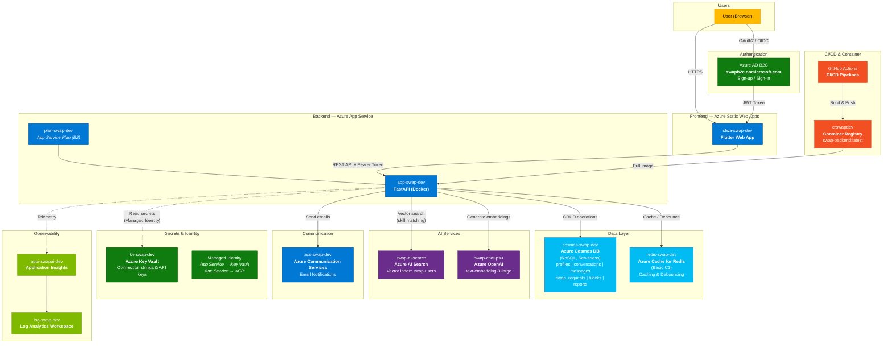

# $wap — Azure Architecture Diagram

Paste the Mermaid code below into [mermaid.live](https://mermaid.live) to render the diagram.

## Resource Group: otito (Azure Subscription 1, centralus)

| Service | Resource Name | Purpose |
|---------|--------------|---------|
| Static Web Apps | `stwa-swap-dev` | Flutter web frontend hosting |
| Azure AD B2C | `swapb2c.onmicrosoft.com` | User authentication (OAuth2/OIDC) |
| App Service | `app-swap-dev` | FastAPI backend (Docker container) |
| App Service Plan | `plan-swap-dev` | Compute for backend (Linux B2) |
| Cosmos DB | `cosmos-swap-dev` | Primary database (6 containers) |
| Redis Cache | `redis-swap-dev` | Caching & email debouncing |
| AI Search | `swap-ai-search` | Vector search for skill matching |
| Azure OpenAI | `swap-chat-psu` | Embedding generation (text-embedding-3-large) |
| Communication Services | `acs-swap-dev` | Transactional email notifications |
| Key Vault | `kv-swap-dev` | Secrets management (connection strings, API keys) |
| Container Registry | `crswapdev` | Docker image storage for backend |
| Application Insights | `appi-swapai-dev` | Application monitoring & telemetry |
| Log Analytics | `log-swap-dev` | Centralized logging |

## Data Flow

1. **User** opens the Flutter web app hosted on **Static Web Apps**
2. **Azure AD B2C** handles sign-up/sign-in and issues a **JWT token**
3. Frontend calls the **FastAPI backend** on App Service with the Bearer token
4. Backend validates the JWT against B2C's JWKS endpoint
5. Profile/swap/message data is stored in **Cosmos DB**
6. When a profile is created/updated, **Azure OpenAI** generates embeddings
7. Embeddings are indexed in **Azure AI Search** for skill matching
8. **Redis** caches frequently accessed data and debounces email notifications
9. **Azure Communication Services** sends transactional emails (welcome, match, swap request)
10. All secrets are stored in **Key Vault**, accessed via **Managed Identity**
11. **Application Insights** collects telemetry, piped to **Log Analytics**
12. **GitHub Actions** builds Docker images, pushes to **Container Registry**, and deploys
